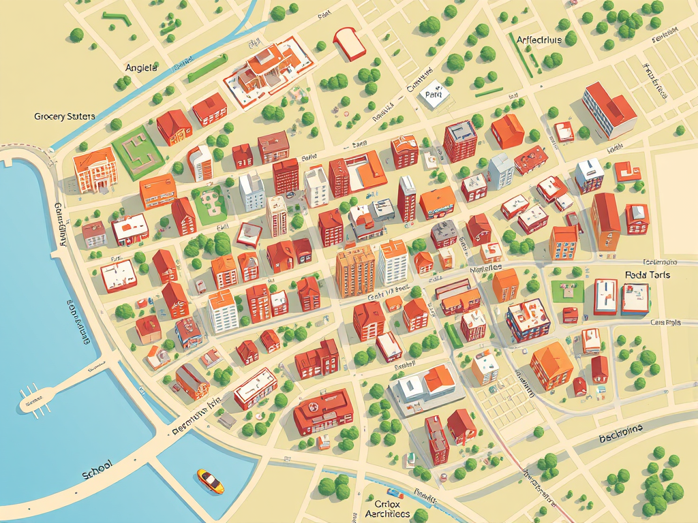
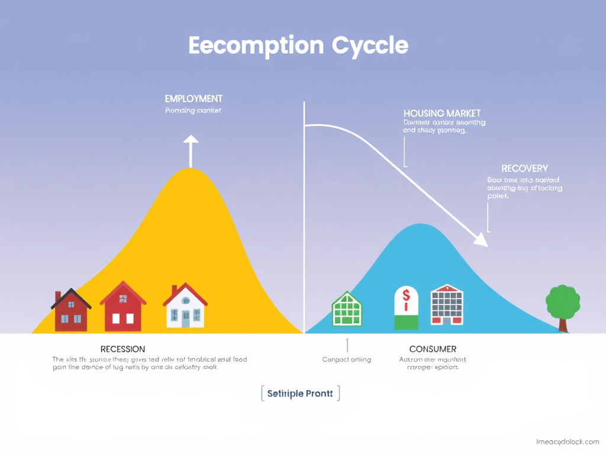

<div align="center">

# 🏙️ Reality RPG

### A hyper-realistic pen-and-paper life simulation ruleset

> No magic. No monsters. Just the beautiful, brutal complexity of being human.

[](https://creativecommons.org/licenses/by-sa/4.0/)
[](#)
[](#)

</div>

---

## What Is This?

**Reality RPG** is a tabletop role-playing game that simulates the full scope of human existence — from waking up and brushing your teeth to navigating career advancement, building relationships, managing mental health, and everything in between. It uses standard pen-and-paper RPG mechanics (dice, attributes, skills, character sheets) applied to the most realistic setting possible: **real life**.

This is not a game about *escaping* reality. It is a game *about* reality. Every mechanic is designed to reflect how actual human life works — with all its beauty, pain, bureaucracy, and randomness.

## ✨ Philosophy

| Fantasy RPG | Reality RPG |
|---|---|
| Your character is a hero | Your character is a person |
| Hit points | Health condition track |
| Magical inventory | Keys, wallet, phone, toilet paper |
| Races (elves, dwarves, orcs) | Ethnicity, culture, privilege, discrimination |
| Potions and elixirs | Coffee, sleep, therapy, medication |
| Quests and dungeons | Job interviews, rent, family obligations |
| Experience points | Life experience, age-based growth |

## 🎲 Core Systems

### Six Core Attributes

Every human being is defined by six attributes rated 1–20, with modifiers calculated as `floor(Attribute ÷ 5)`:

| Attribute | Represents |
|---|---|
| 🏋️ **Vigor** | Physical health, stamina, strength, endurance |
| 🧠 **Intellect** | Cognitive ability, memory, analytical thinking |
| 💬 **Expression** | Communication, empathy, creativity, emotional intelligence |
| 🎯 **Dexterity** | Fine motor skills, coordination, precision |
| 🛡️ **Resolve** | Willpower, discipline, emotional regulation, stress resistance |
| ✨ **Presence** | Appearance, charisma, confidence, first impressions |

### Character Creation

Characters are built using a **unified progressive point-buy system** — one budget for attributes, skills, advantages, and disadvantages. Your budget scales with age (100–160 points), reflecting the reality that older characters have had more time to develop. No "races" or "classes" — just ethnicity, culture, socioeconomic background, mental health, and personality traits, all grounded in real-world origins.

### Health & Stress

Instead of hit points, characters track **Health** on a condition track (Healthy → Tired → Sick → Injured → Critical → Dead) and **Stress Points** on a pool tied to their Resolve attribute. Both degrade from real-world causes: poor sleep, malnutrition, illness, trauma, financial pressure, discrimination, grief.

## 👥 Example Characters

<div align="center">


*Mei — Software Engineering Intern, 23 · Marcus — Auto Mechanic, 42 · Carlos — Warehouse Worker & Student, 21 · Elaine — Retired Teacher, 72*

</div>

Eight fully-built characters demonstrate every mechanic: ethnicity, culture, mental health conditions, socioeconomic status, personality traits, daily routines, and more. Use them as templates or ready-to-play characters.

<div align="center">


*Raj — Internal Medicine Resident, 35 · Tallulah — Cultural Liaison, 38 · Youssef — Political Science Grad Student, 24 · Sofia — Freelance Designer, 29*

</div>

<div align="center">


*Derek — Construction Worker · Tyler — Data Analyst · Aisha — Community Leader*

</div>

## 📚 Ruleset Structure

The complete ruleset is delivered as a linked set of HTML pages, each covering a domain of human existence:

### Core Rules

| Page | Covers |
|---|---|
| [🎲 Core Mechanics](core-mechanics.html) | d100 resolution, attributes, skills, stress, health, time system, target numbers |
| [👤 Character Creation](character-creation.html) | Point buy, ethnicity, culture, socioeconomic background, personality traits |
| [📋 Character Sheet](character-sheet.html) | Print-ready 4-page character sheet |

### Identity & Wellbeing

| Page | Covers |
|---|---|
| [🧠 Mental Health](mental-health.html) | Conditions, stress, treatment, therapy, episodes, safety tools |
| [🧩 Neurodivergence](neurodivergence.html) | ADHD, autism, BPD, schizophrenia, learning disabilities |
| [♿ Disability](disability.html) | Mobility, sensory, chronic conditions, accessibility |
| [💕 Sexual Health](sexual-health.html) | Intimacy, consent, STIs, contraception, pregnancy, gender identity |

### Daily Life

| Page | Covers |
|---|---|
| [🌅 Daily Life](daily-life.html) | Sleep, hygiene, nutrition, commuting, work, chores |
| [🤝 Social Dynamics](social-dynamics.html) | Relationships, conflict, social status, networking, romance |
| [🎒 Inventory & Economy](inventory-economy.html) | Mundane items, money, rent, bills, groceries |
| [🏋️ Exercise & Fitness](exercise.html) | Gym, sports, martial arts, progression, injury |

### Society & Systems

| Page | Covers |
|---|---|
| [⚖️ Law & Civic Life](law-civic.html) | Voting, taxes, immigration, legal encounters, military |
| [📊 Macro Economy](macro-economy.html) | Inflation, credit scores, housing, investing, gig economy |
| [🌍 Geography & Mobility](geography-mobility.html) | Moving, visas, expat life, diaspora, travel |
| [💻 Remote Work & Careers](remote-work.html) | Telecommuting, freelancing, job hunting, burnout |
| [💞 Relationship Structures](relationship-structures.html) | Polyamory, situationships, roommates, elder care |
| [🙏 Religion & Spirituality](religion-spirituality.html) | Worship, deconversion, trauma, interfaith |
| [✊ Politics & Activism](politics-activism.html) | Protesting, organizing, running for office, misinformation |

### Family & Life Events

| Page | Covers |
|---|---|
| [👶 Family & Children](family-children.html) | Pregnancy, parenting, adoption, co-parenting |
| [🕊️ Death & Grief](death-grief.html) | Grief, end-of-life care, funerals, dementia, legacy |

### Environment & Conflict

| Page | Covers |
|---|---|
| [🌦️ Environment](weather-environment.html) | Weather, seasons, disasters, pets, digital life |
| [🔫 Weapons & Violence](weapons.html) | Firearms, blades, self-defense, legal consequences |
| [🚗 Vehicles & Transportation](vehicles.html) | Cars, bikes, air travel, insurance, accidents |

### GM Resources

| Page | Covers |
|---|---|
| [🎬 Sample Campaigns](campaigns.html) | Four complete campaign arcs with NPCs and timelines |
| [🛠️ GM Tools](gm-tools.html) | Random event tables, NPC generator, crisis tracker |
| [⚔️ Fantasy vs Reality](comparative.html) | Side-by-side comparisons of fantasy RPG → real-world equivalents |

## 🖼️ Visual Assets

<div align="center">


*A stylized neighborhood map for grounding campaigns in a tangible setting*

</div>

<div align="center">


*Economic cycle diagram — recession and recovery phases*

</div>

<div align="center">


*Multi-generational family — representing diverse relationship structures*

</div>

## How to Play

1. **Gather 3–7 people** — one Game Master plus 2–6 players
2. **Create characters** using the character creation system (age, attributes, ethnicity, culture, mental health, traits)
3. **The GM runs the world** — controlling NPCs, resolving consequences, tracking time
4. **Play proceeds in time increments** — minutes during tense scenes, hours during routines, days during mundane stretches, weeks/months during stability

### What You Need

- Polyhedral dice (especially **d6s and d10s**)
- [Character sheets](character-sheet.html) (printable)
- Pencils and notepads
- **Empathy and maturity** — this game deals with real human struggles

> ⚠️ This game can explore heavy topics: poverty, mental illness, discrimination, addiction, grief. Establish **safety tools** (Lines and Veils) before play begins.

## 🔧 Technical

The ruleset is delivered as a **static HTML site** — no build step, no dependencies. Open `index.html` in any browser. Each chapter is a standalone HTML page linked together with shared CSS.

```
realityrpg/
├── index.html                    # Homepage / ruleset overview
├── core-mechanics.html           # d100 system, attributes, skills, health, stress
├── character-creation.html       # Point buy, ethnicity, culture, traits
├── character-sheet.html          # Print-ready 4-page character sheet
├── mental-health.html            # Conditions, treatment, episodes, safety tools
├── neurodivergence.html          # ADHD, autism, BPD, schizophrenia
├── disability.html               # Physical conditions, accessibility
├── daily-life.html               # Sleep, hygiene, nutrition, work, chores
├── social-dynamics.html          # Relationships, conflict, networking
├── inventory-economy.html        # Items, money, rent, groceries
├── comparative.html              # Fantasy RPG vs. real-world equivalents
├── example-characters.html       # 8 fully-built diverse characters
├── sexual-health.html            # Intimacy, consent, STIs, pregnancy
├── family-children.html          # Parenting, adoption, co-parenting
├── death-grief.html              # Grief, end-of-life, legacy
├── law-civic.html                # Voting, taxes, immigration, military
├── weather-environment.html      # Weather, disasters, pets, digital life
├── macro-economy.html            # Inflation, credit, housing, investing
├── geography-mobility.html       # Moving, visas, expat life, travel
├── remote-work.html              # Telecommuting, freelancing, burnout
├── relationship-structures.html  # Polyamory, roommates, elder care
├── religion-spirituality.html    # Worship, deconversion, interfaith
├── politics-activism.html        # Protesting, organizing, activism
├── campaigns.html                # 4 complete campaign arcs
├── gm-tools.html                 # Random tables, NPC generator
├── exercise.html                 # Gym, sports, martial arts
├── weapons.html                  # Firearms, blades, self-defense
├── vehicles.html                 # Cars, bikes, insurance, accidents
├── css/style.css                 # Shared stylesheet
└── img/                          # Character portraits, diagrams, maps
```

## 📖 License

This project is released under the **Creative Commons Attribution-ShareAlike 4.0 International** license. You are free to share and adapt this material for any purpose, provided you give appropriate credit and distribute your contributions under the same license.

---

<div align="center">

**Reality RPG** — Because the most interesting adventures happen in real life.

</div>
